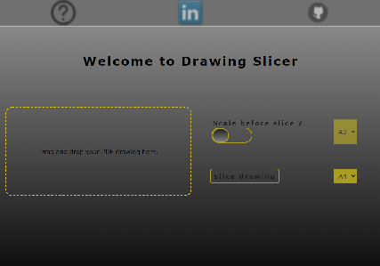

# Drawing Slicer !
*************************************************
## APPLICATION URL https://drawing-slicer.herokuapp.com/
*************************************************
Drawing slicer is application developed mostly for DIY hobbiest who are interested in printing huge drawing formats without necessity of owning large scale printer. Drawing slicer will slice your standard ISO drawing into smaller drawings of your choice (A4 is the most favourite one).

## Idea ?

I came up with this idea when I needed to print template for manufacturing of my giant surfskate. Due to pandemic I was not able to do so, so I developed short python script which will cut my A0 design into A4 format. 

1. Drawing created in CAD

<p align="center">
  
</p>

2. Sliced drawing with Drawing-Slicer and merged with tape

<p align="center">
  
</p>

3. Giant surfskate (cut based on template from step 2)

<p align="center">
  
</p>

## Backend ?

Core of the backend is based on NodeJs application written in typescript. Backend however uses python microservices, in order to handle reading and cutting of the pdf file. Also algorithmic part of slicing is done by python microservices. Users pdf file is handled with AWS S3 bucket storage system, whose bucket data are cleared with every succesful download.

## Frontend ? 

Frontend is based on React framework and as backend, also frontend is written in typescript. User actions are dynamically driven by use-state hooks. CSS naming classes uses BEM structure convention.

<p align="center">
  
</p>

## Initialize pythonServices virtual environment (Windows)

1. Create python venv in this folder with:

``` text
python -m venv python_modules
``` 

2. Activate venv with:

``` text
. python_modules\Scripts\activate
``` 

3. Install external packages with:

``` text
pip install -r requirements.txt
```  

4. Check if path to python interpreter is set correctly at config.ts file

``` javascript
const config: configVariablesInterface = {
    PYTHON_INTERPRETER_PATH: (process.env.NODE_ENV === 'production') ? 'python' :
    (path.resolve(process.cwd(), 'python_modules/Scripts/python')),
    PYTHON_SLICE_SERVICE_PATH: (path.resolve(process.cwd(), 'python_services/service_slice_file.py')),
    PYTHON_INPUT_TEST_SERVICE_PATH: (path.resolve(process.cwd(), 'python_services/service_validate_file.py'))
}
```

Alternatively put this sequence into cmd.

``` text
python -m venv python_modules && python_modules\Scripts\activate && pip install -r requirements.txt
```  